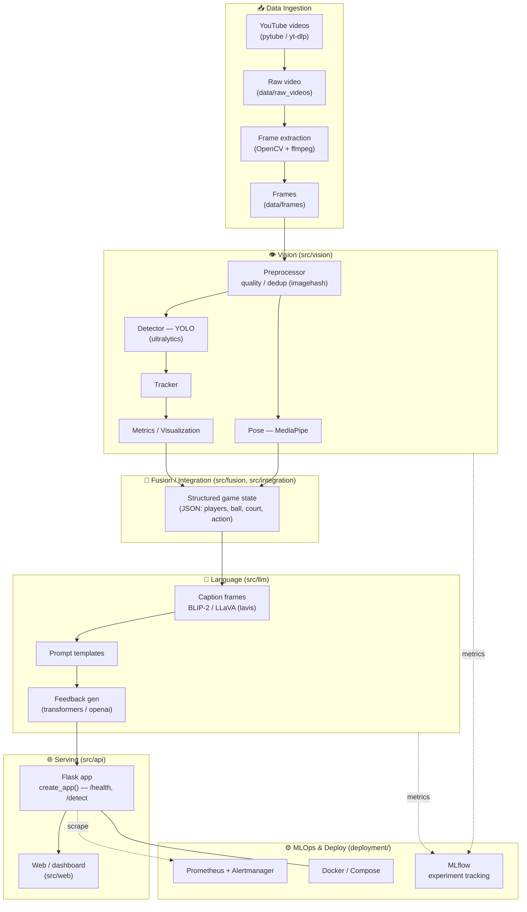

# 🏓 Pickleball-Vision-LLM — Architecture & Tech Stack

> Generated 2026-06-06 from the live codebase (`origin/main`). Diagram + stack
> reflect what is actually imported/used in `src/` and `deployment/`, not an
> aspirational design.

---

## 🧭 System Architecture

**Flow:** YouTube → frames → vision (detect/pose/track) → structured game
state → LLM captioning + coaching feedback → Flask API / dashboard. MLflow
tracks experiments; Docker + Prometheus/Alertmanager handle deploy + monitoring.

---

## 🧱 Module Map (`src/`)

| Module | Role | Status |
|--------|------|--------|
| `src/core/` | Config (`settings.py`), logging, shared utils | 🟢 real |
| `src/vision/detection/` | YOLO detector, data collection, preprocessing, metrics, viz | 🟢 real |
| `src/vision/{tracking,preprocessing,postprocessing}/` | Tracking + frame prep | 🟡 partial / overlaps detection |
| `src/llm/` | Captioning (BLIP-2/LLaVA), prompt templates, feedback, training | 🟡 mixed real/stub |
| `src/fusion/` | Vision↔LLM join, utils | 🟡 duplicates core utils |
| `src/integration/` | analytics / streaming / fusion glue | 🔴 stubs |
| `src/api/` | Flask `create_app()` service | 🟢 minimal, runnable |
| `src/temp/` | Old FastAPI experiment (broken imports) | 🔴 to remove |
| `src/web/` | Frontend / dashboard | 🔴 stub |

See `docs/PLAN.md` for the cleanup/build roadmap.

---

## 🔧 Tech Stack (grounded in actual imports)

### Computer Vision
| Tool | Use |
|------|-----|
| **OpenCV** (`cv2`) | Frame I/O, image ops (most-used dep) |
| **Ultralytics YOLO** | Ball / player / court object detection |
| **MediaPipe** | Player pose / keypoint estimation |
| **PyTorch** + **torchvision** | Model backbone / inference |
| **NumPy**, **SciPy**, **scikit-learn** | Numerics, filtering, metrics |
| **imagehash**, **Pillow** | Frame dedup / image hashing |
| **matplotlib** | Visualization |

### Language / Multimodal
| Tool | Use |
|------|-----|
| **Transformers** (HuggingFace) | LLM inference |
| **LAVIS** (`lavis`) | BLIP-2 / vision-language captioning |
| **OpenAI** | Hosted LLM feedback generation |

### Data Ingestion
| Tool | Use |
|------|-----|
| **pytube** / yt-dlp | YouTube video download |
| **ffmpeg** (`ffmpeg-python`) | Video decode / frame extraction |

### Backend / API
| Tool | Use |
|------|-----|
| **Flask** | Service entry (`src/api`, `create_app()`) — current |
| **FastAPI** | Older serving experiment in `src/temp` (relic) |
| **Pydantic** | Schemas / validation |

### MLOps / Ops
| Tool | Use |
|------|-----|
| **MLflow** | Experiment + metric tracking |
| **Docker** + Compose | Containerized deploy (`deployment/`) |
| **Prometheus** + **Alertmanager** | Monitoring + alerting |
| **pre-commit** | Lint/format gate |
| **Makefile** | Task automation |

### Utilities
`PyYAML` (config) · `python-dotenv` (env) · `loguru` (logging) · `tqdm`
(progress) · `requests` · `smtplib`/`email` (alert delivery)

### Language / Runtime
- **Python** (`>=3.10,<3.13`, per `pyproject.toml`)
- `src` layout, installable via `pip install -e .` with extras
  `[vision]` / `[llm]` / `[mlops]` / `[dev]`

---

## References / Further reading
- Vision: [Ultralytics YOLO](https://docs.ultralytics.com/) · [Roboflow supervision (ByteTrack/annotators)](https://supervision.roboflow.com/) · [MediaPipe](https://ai.google.dev/edge/mediapipe/solutions/guide) · [OpenCV](https://docs.opencv.org/) · [PyTorch](https://pytorch.org/docs/stable/index.html)
- Multimodal/LLM: [HuggingFace Transformers](https://huggingface.co/docs/transformers/index) · [LAVIS (BLIP-2)](https://github.com/salesforce/LAVIS) · [AWS Bedrock](https://docs.aws.amazon.com/bedrock/)
- Backend/ops: [Flask](https://flask.palletsprojects.com/) · [MLflow](https://mlflow.org/docs/latest/index.html) · [Prometheus](https://prometheus.io/docs/) · [Docker](https://docs.docker.com/)
- Internal: `docs/MODELS_AND_REUSE.md` · `docs/specs/RFC-001-video-analysis-pipeline.md` · `docs/assets/system_design.png`
